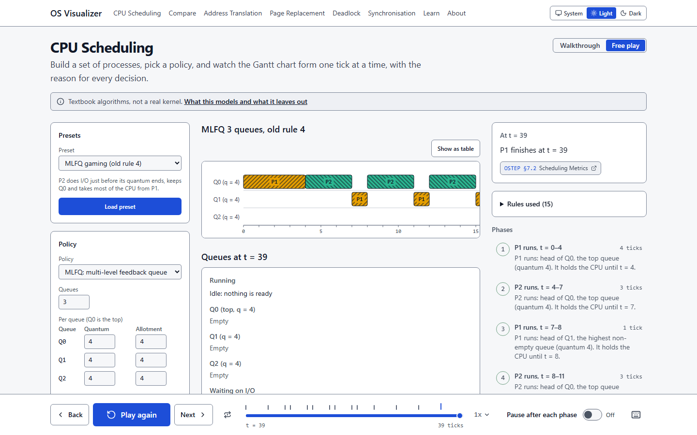
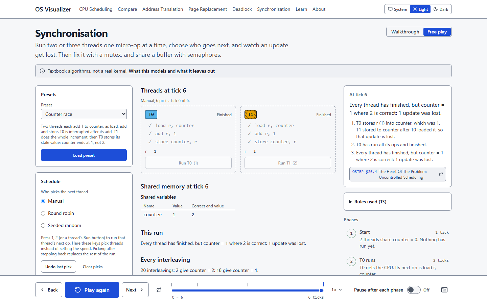
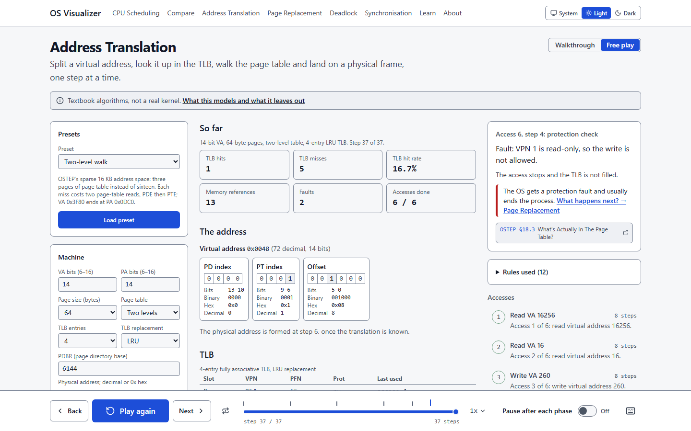
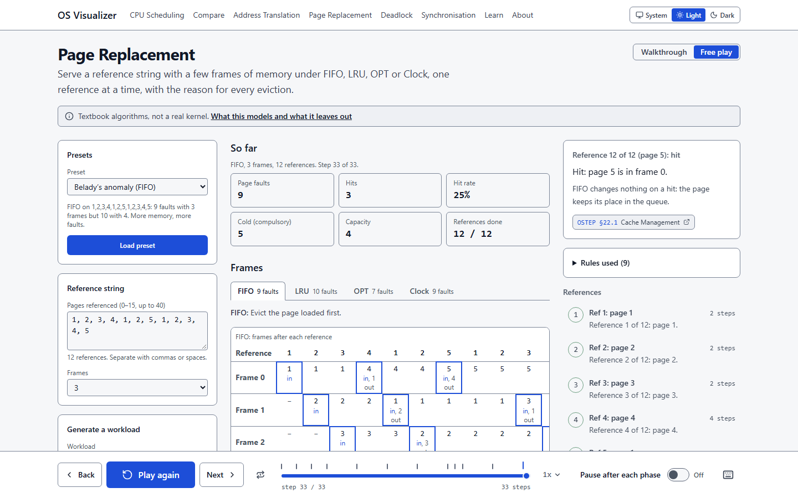
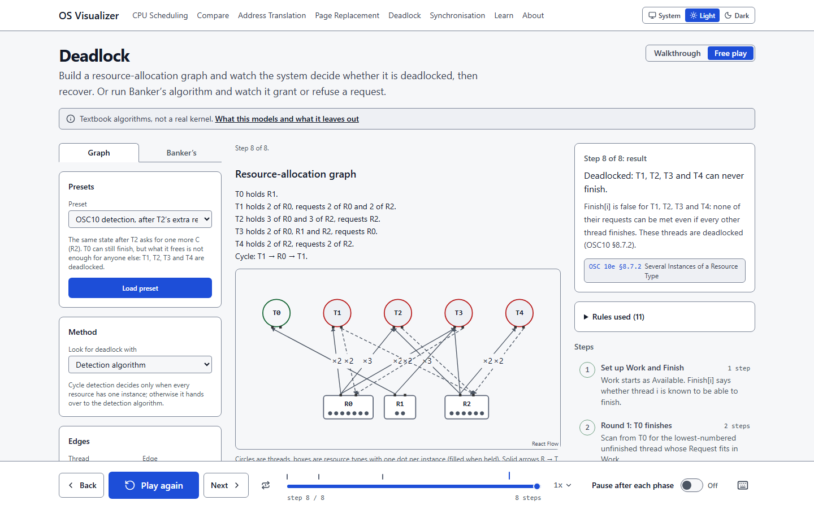
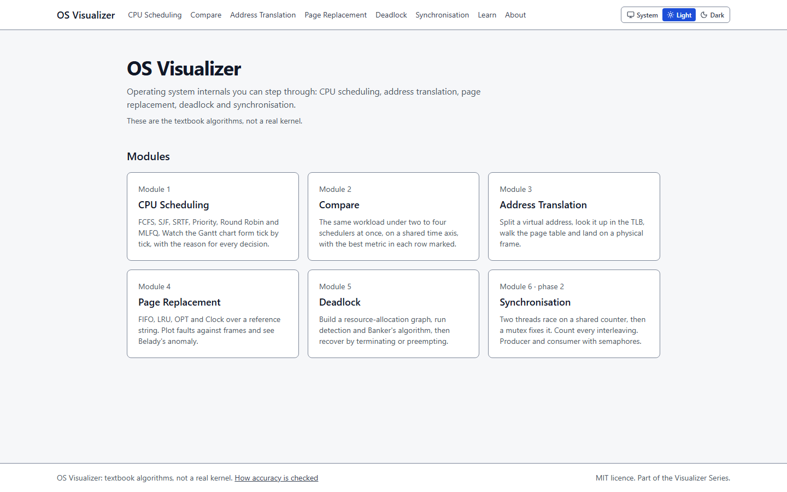

# OS Visualizer

**Operating system internals you can step through: CPU scheduling, address translation,
page replacement, deadlock and synchronisation, one tick or one step at a time, forwards
and backwards, with the reason for every decision on screen.**

Third project in the Visualizer Series, after Internet Visualizer and Crypto Visualizer.
These are the textbook algorithms (OSTEP v1.10 and Silberschatz's _Operating System
Concepts_, 10th edition), not a real kernel, and the product says so on every page.



## Modules

| #   | Module                                         | What you step through                                                                                                                                           |
| --- | ---------------------------------------------- | --------------------------------------------------------------------------------------------------------------------------------------------------------------- |
| 1   | [CPU Scheduling](src/modules/scheduling)       | FCFS, SJF, SRTF, Priority (with aging), Round Robin and MLFQ, with I/O bursts and a context-switch cost. Waiting, turnaround and response time per process.    |
| 2   | [Compare](src/modules/compare)                 | One workload under two to four policies on a shared time axis, with the best value in each metric marked and a generated "Why?" line.                           |
| 3   | [Address Translation](src/modules/translation) | Virtual address → VPN and offset → TLB → one- or two-level page-table walk → protection → physical address, and a page-table size calculator.                   |
| 4   | [Page Replacement](src/modules/replacement)    | FIFO, LRU, OPT and Clock over a reference string, the faults-against-frames curve for every policy, and Belady's anomaly.                                       |
| 5   | [Deadlock](src/modules/deadlock)               | A resource-allocation graph, built with a form or by dragging; cycle detection, the detection algorithm, Banker's safety and request algorithms, and recovery. |
| 6   | [Synchronisation](src/modules/sync)            | Threads as load/add/store micro-ops: pick the interleaving by hand and lose an update, fix it with a test-and-set mutex, then producer/consumer with semaphores. |

Every module has a **Walkthrough** (a lesson with checkpoints that ask you to predict the
next step, listed at `/learn`) and **Free play**. Every input is editable, every preset
reproduces a textbook situation, and any run is a link (`?s=`).



<table>
  <tr>
    <td></td>
    <td></td>
  </tr>
  <tr>
    <td></td>
    <td></td>
  </tr>
</table>

## How accuracy is checked

Every algorithm is pure TypeScript in `src/core/` (no React, no clock, no unseeded
randomness: lint rules enforce it) and is checked three ways:

1. **Textbook worked examples.** The books' own numbers, as tests. Each fixture names its
   book, edition and section; [tests/fixtures/README.md](tests/fixtures/README.md) lists
   them all.
2. **Property tests** with fast-check and a fixed seed: total run time is CPU bursts plus
   idle plus context-switch ticks; LRU and OPT never fault more with more frames; at most
   one thread is ever inside a mutex; a semaphore's value is always its initial value +
   signals − completed waits.
3. **Brute-force oracles** where search is feasible: the minimum faults over every
   eviction choice must equal OPT; every thread ordering is tried to confirm Banker's
   algorithm and detection; every interleaving of a synchronisation program is counted
   naively to confirm the explorer.

Every preset is run twice and must give identical runs, every step cites a section that
resolves, and **every tie-break the textbooks leave open is a rule**: shown in the module's
"Rules used" panel, collected on `/about`, and tested by name.
[docs/ACCURACY.md](docs/ACCURACY.md) lists every source, every convention and every
known simplification, and a test fails if the product cites anything it does not list.

Accessibility and performance are tested too: axe on every route in both themes and both
modes, a keyboard-only walk through every module, a colour-blind (deuteranopia) check of
the charts, and a first-load JS budget per route ([perf/README.md](perf/README.md)).

## Running it

Node 22 or later.

```bash
npm install
npm run dev          # http://localhost:3000
npm run verify       # lint, typecheck, unit tests, build, bundle budget
npm run test:e2e     # Playwright + axe against a production build on :3100
```

| Script                           | What it does                                                                                |
| -------------------------------- | ------------------------------------------------------------------------------------------- |
| `npm run test`                   | Vitest: `core` (node: `src/core`, `tests/`) and `ui` (jsdom: components, modules, lessons) |
| `npm run perf:bundles`           | Per-route first-load JS against its budget; React Flow only on `/deadlock`                  |
| `node scripts/screenshots.mjs`   | The screenshots above, from a running production build                                      |
| `npm run format` / `format:check` | Prettier                                                                                    |

`FC_SEED=<n>` replays a property-test run with another seed.

## Layout

```
src/core/       algorithms, events, citations, URL state: framework-free, deterministic
src/components/ shared UI: timeline, Gantt, frame strip, matrix, inspector, lessons
src/modules/    one folder per module; renders the core's events, decides nothing
src/content/    the MDX lessons
src/app/        routes
tests/          fixtures (worked examples), oracles, determinism, citations, accuracy
e2e/            Playwright: per-module flows, axe, keyboard, colour-blind
```

Next.js 16, TypeScript, React 19, Tailwind CSS 4, Zustand, Zod, React Flow (deadlock
graph only), MDX, Vitest, fast-check, Playwright. No database; progress and saved inputs
live in `localStorage` (`osv:v1`).

## Licence

MIT.
